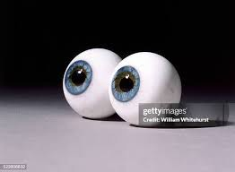

# Project Title


`npm install`
# header
**big bolding text with big bold words that is also _italic_**
## small header
>am i on <sup>top</sup> of the ~~world~~, or simply at the <sub>bottom</sub> of it <ins>all</ins>

 me, right now
### even smaller header
<a name="big-ol-test-name"></a>
# Git commands
```
git status
git add
git commit
I think can type anything in here so I could just use this to look fancy  
```
`  #000000` 
I enjoy this color over white

`rgb(255,0,0) ` red, but using RGB instead of hex

have you ever watched the first video on youtube?  its [here](https://www.youtube.com/watch?v=jNQXAC9IVRw) if you want to

if you forgot how to scroll to the top here is the part where I got a bit funky with the text, not the previous here, but this [here](#small-header).

I made a new text document for this, it has nothing in it but here is a link anyway [Link of the document assuming it works](example_document).


[I made a thing, I think it works](#big-ol-test-name)  
eyeballs  


- did you know that lists exist
* I know its shocking
+ honestly im not sure why we invented them
1. now we have numbers
2. this is getting a little eldritch 
3. don't you agree?
    - its even more strange
        * we are even getting squares in this list
- [X] frankly I don't know where this joke was going it has exceeded its welcome 
- [ ] we got more list types though

I don't know how to write a example  for this next one uh what do you think @EvanE1233   

[^1]: we also got emojis :+1:
> [!NOTE]  
> im not sure where footnotes go but there is one

<!-- psst don't tell the markdown users im here, im sneaking -->
